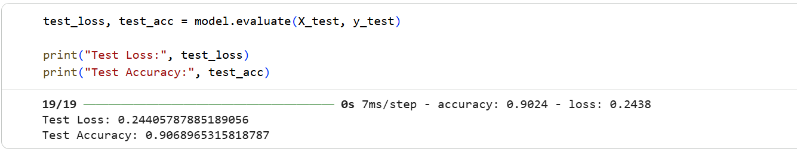
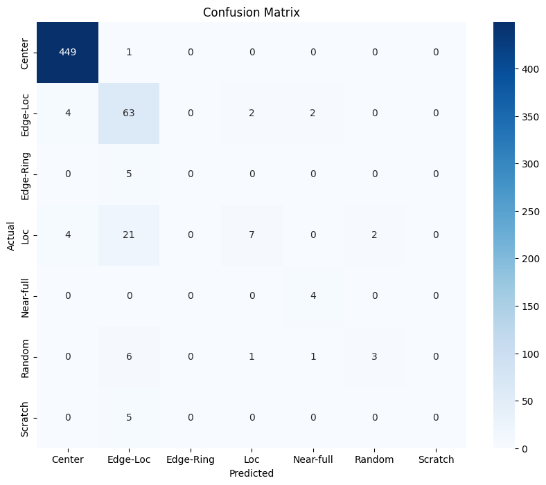
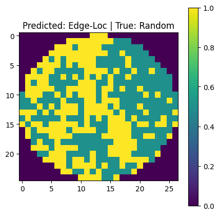

# AI-Based Wafer Defect Classification

This project applies deep learning to semiconductor wafer inspection using the WM-811K wafer map dataset.

A Convolutional Neural Network (CNN) was built using TensorFlow to automatically classify wafer defect patterns from wafer maps.

Defect classes include:

- Edge-Ring
- Edge-Loc
- Center
- Scratch
- Donut
- Random
- Near-full

## Dataset

WM-811K Wafer Map Dataset  
~811,000 wafer maps used in semiconductor defect analysis.

## Method

The project pipeline includes:

1. Data cleaning and preprocessing
2. Filtering defect wafers
3. Converting wafer maps into image arrays
4. Training a CNN model
5. Predicting wafer defect types
6. Generating automated defect alerts

## Model

Convolutional Neural Network (CNN)

Architecture:

- Conv2D
- MaxPooling
- Dense layers
- Softmax output

## Results

Model Test Accuracy: **90.7%**

The CNN model successfully classifies semiconductor wafer defect patterns such as:

- Edge-Ring
- Edge-Loc
- Center
- Scratch
- Donut
- Random
- Near-full
## Model Training Result

## Model Evaluation

## Example Wafer Defect Prediction

## Technologies Used

- Python
- TensorFlow / Keras
- NumPy
- Pandas
- Matplotlib
- Scikit-learn

## Author

Anwar Hakim Tamim  
MS Microelectronics and Semiconductor Engineering  
University at Buffalo
